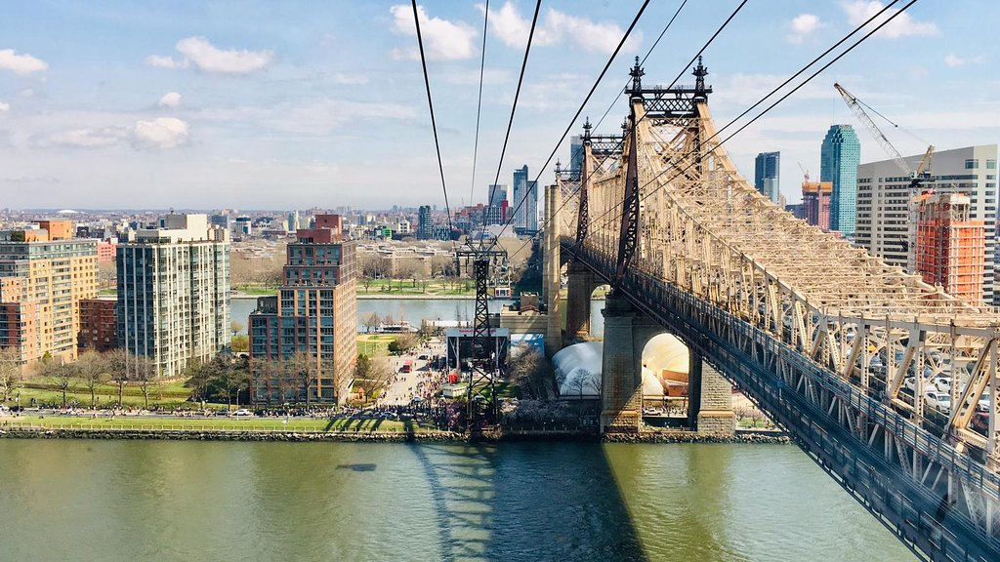
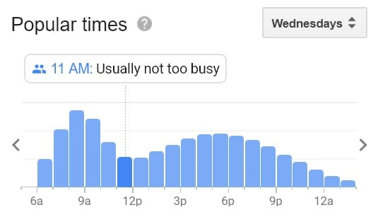
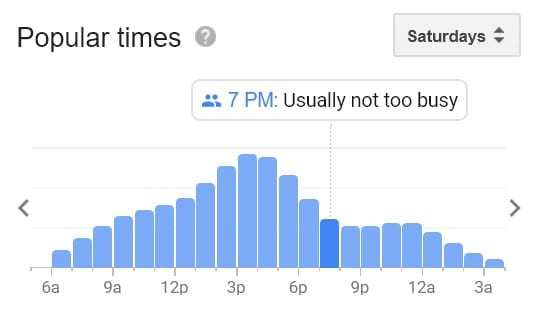

# Final Project
# TramWatch

Using the tools and techniques you learned in this class, design, prototype and test an interactive device.

Project Github page set up - May 3

Functional check-off - May 10
 
Final Project Presentations (video watch party) - May 12

Final Project Documentation due - May 19

## Objective

The goal of this final project is for you to have a fully functioning and well-designed interactive device of your own design.  

The Roosevelt Island Tramway is one of the iconic attractions in New York City and it has been in many films and TV shows, including Spider-Man (2002) and White Collar (2013). It runs every 7-15 minutes from 59th Street and Second Avenue in Manhattan to Tramway Plaza on Roosevelt Island and each car holds up to 110 people and about 115 trips are made daily. 

Despite being the coolest way to get around New York City, the lack of online real-time scheduling system has been quite a frustration for New Yorkers who commute regularly to the island.   

As seen on their website: https://rioc.ny.gov/302/Tram, only hours of operation and set schedules are available to users. Besides, Google Maps has no tram time related information when planning for a commute. The only way for users to obtain live tram schedule is to physically arrive at the tram station and read off the sign.

Furthermore, New Yorkers are getting more conscious of crowdedness data for public transport due to Covid-19 pandemic. The closest option for users to obtain live tram crowdedness data would be using Google maps's machine learning algorithm relying on its user base for manual data input as well as powerful prediction models. 

Don’t we all wish there was some tool that allows us to know when the tram is arriving as well as how crowded the tram station is without needing to go there first?

Introducing TramWatch, a real-time tram tracking smart watch which provides live crowdedness data at tram stations. We hope to improve the Roosevelt Island Tramway taking experience by not only making it more time efficient but most importantly safer. 

## Teams

You can and are not required to work in teams. Be clear in documentation who contributed what. The total project contributions should reflect the number of people on the project.

Justin Liu jl4275

Angus (Ting-Yu) Lin tl799

Eric (Yen-Hao) Chen yc2645 

## Description
Your project is to design and build an interactive device to suit a specific application of your choosing. 

## Design
I am a bad Designer

## Prototype

## Reflection

## Deliverables

1. Documentation of design process
2. Archive of all code, design patterns, etc. used in the final design. (As with labs, the standard should be that the documentation would allow you to recreate your project if you woke up with amnesia.)
3. Video of someone using your project (or as safe a version of that as can be managed given social distancing)
4. Reflections on process (What have you learned or wish you knew at the start?)

## Examples

[Here is a list of good final projects from previous classes.](https://github.com/FAR-Lab/Developing-and-Designing-Interactive-Devices/wiki/Previous-Final-Projects)
This version of the class is very different, but it may be useful to see these.
