# Final Project
# TramWatch

Using the tools and techniques you learned in this class, design, prototype and test an interactive device.

Project Github page set up - May 3

Functional check-off - May 10
 
Final Project Presentations (video watch party) - May 12

Final Project Documentation due - May 19

## Objective

The goal of this final project is for you to have a fully functioning and well-designed interactive device of your own design.  

The Roosevelt Island Tramway is one of the iconic attractions in New York City and it has been in many films and TV shows, including Spider-Man (2002) and White Collar (2013). It runs every 7-15 minutes from 59th Street and Second Avenue in Manhattan to Tramway Plaza on Roosevelt Island and each car holds up to 110 people and about 115 trips are made daily. 

Despite being the coolest way to get around New York City, the lack of online real-time scheduling system has been quite a frustration for New Yorkers who commute regularly to the island.   

As seen on their website: https://rioc.ny.gov/302/Tram, only hours of operation and set schedules are available to users. Besides, Google Maps has no tram time related information when planning for a commute. The only way for users to obtain live tram schedule is to physically arrive at the tram station and read off the sign.

Furthermore, New Yorkers are getting more conscious of crowdedness data for public transport due to Covid-19 pandemic. The closest option for users to obtain live tram crowdedness data would be using Google maps's machine learning algorithm relying on its user base for manual data input as well as powerful prediction models. 

Don’t we all wish there was some tool that allows us to know when the tram is arriving as well as how crowded the tram station is without needing to go there first?

Introducing TramWatch, a real-time tram tracking smart watch which provides live crowdedness data at tram stations. We hope to improve the Roosevelt Island Tramway taking experience by not only making it more time efficient but most importantly safer. 

## Teams

You can and are not required to work in teams. Be clear in documentation who contributed what. The total project contributions should reflect the number of people on the project.

Justin Liu jl4275 - Tram Tracking

Angus (Ting-Yu) Lin tl799 - Crowd Counting

Eric (Yen-Hao) Chen yc2645 - Tram Watch

## Description
Your project is to design and build an interactive device to suit a specific application of your choosing. 

From the above-mentioned problem, we hope to integrate our solution into an all-in-one connected device - TramWatch, a real-time tram tracking smart watch which provides live crowdedness data at tram stations. It is consist of three main features: 

1. Real-time tram schedule tracking  
    Provides user real-time tram location as well as the estimated arrival time. User can then better utilize his or her time, and more efficiently plan the route.  

2. Crowdedness data visualization at tram stations  
    Monitor the station and provide user the exact amount of people that are currently at the tram station. By capturing the crowdedness data of each station, TramWatch provides user the oppurtunity to avoid the crowd. 

3. Flip-To-Watch Interactive Energy Saving Feature  
    The sensor detects the angle of the watch face and only display the tram information when user tilts the watch. The energy saving feature not only makes the device more interactive but also energy efficient.

## Design
### The Watch/Gauntlet/Mech-suit Arm/Thanos' Glove
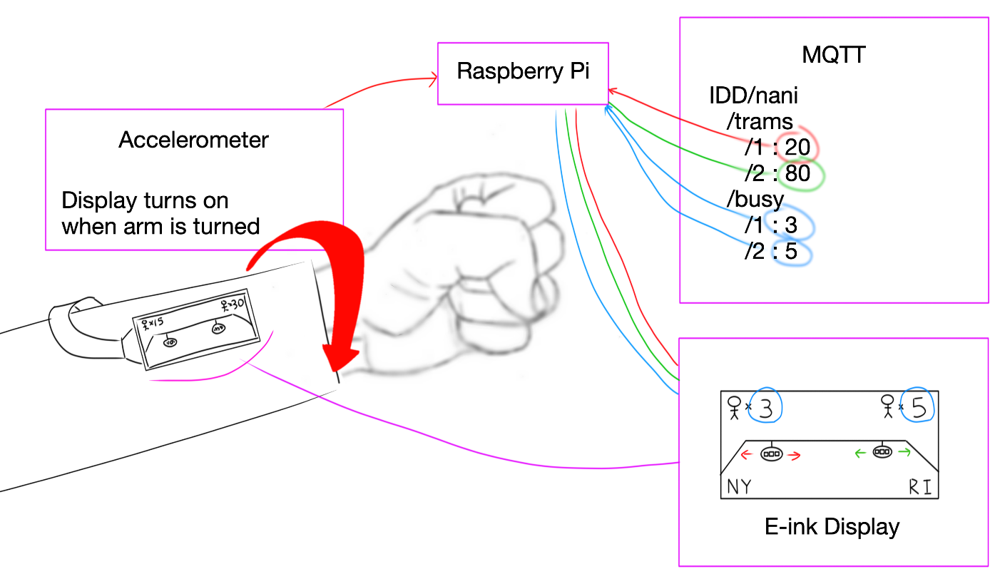

The watch was built with the following:
- Raspberry Pi
- Waveshare 2.13inch E-Paper (D)
- Adafruit MPU-6050 6-DoF Accelerometer
- Cardboard

A beautiful cardboard prototype was built for the best user interaction and experience. Including the accelerometer enabled us to detect the orientation of the users hand, allowing us to turn off the display when the user’s palm was facing downwards. An E-ink display was used - mainly because it was the only display module we had that could be wired far away from the Pi - but also due to its physical flexibility. Data received over MQTT was used to update the E-ink display, where we displayed the live tram positions as well as the crowdedness of the stations. Since the E-ink display required a special sequence to reset before displaying the next frame, the refresh rate of our display was severely reduced - thankfully not too limiting for our purposes (the tram moves extremely slowly).

### Tram & People Tracking
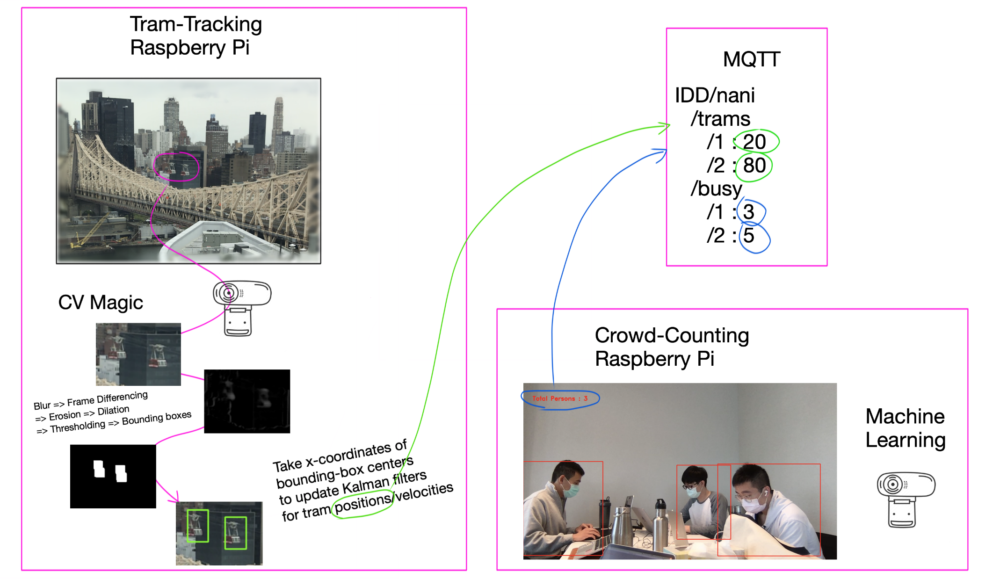
To track the trams' live positions and the crowdedness in stations, the other two Raspberry Pi's were used along with Pi-Cameras. However, for the purposes of testing and faster runtimes, the scripts were instead run on our computer with connected webcams. 

Tram-tracking was done with the help of `OpenCV` functions to find the moving trams against the still background, and a lot of testing was done on filtering out noise and only detecting the trams. The camera was placed on the roof of The House for the best view of the tram crossing the river; to eliminate detection of other moving objects in the scene (cars and boats), a library for selecting ROI (Regions of Interest) was used to only select the portion of the video feed where trams passed through. With the trams detected, the x-coordinates of the bounding boxes were taken and fed into a Kalman filter (with the help of the `filterpy` library), allowing the script to predict the  trams’ movement and make updates using the observed trams’ positions. Special care was taken to ignore video readings when the trams overlapped each other or when they were occluded by the tower/bridge. The relative positions of the trams were then converted to their actual positions over the entire tramline.

Crowd-counting was accomplished with the help of `mobilenet v2` from `tensorflow`. Running this model against the video feed yields a set of all detected objects, and after filtering - by only considering objects that are ‘people’ with a confidence score over 0.7 - the number of people within the camera’s field of view can be determined.

Both trams’ positions and the number of people in each station were sent over MQTT under the main topic `IDD/nani/trams` for reading by the Raspberry Pi on the watch.

## Prototype

### Video of Display Design

### Beautiful Display Design
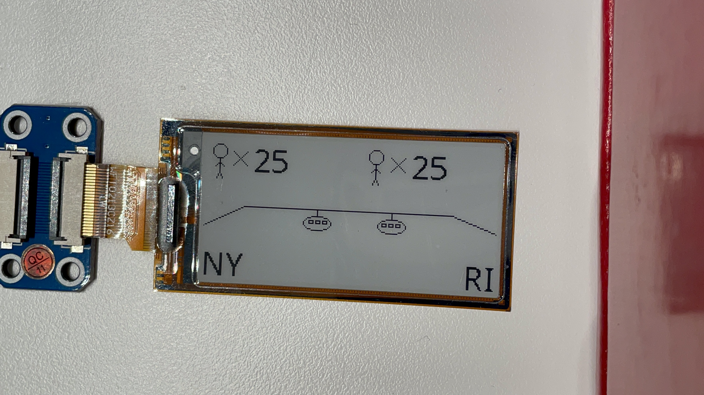

### Resetting Display
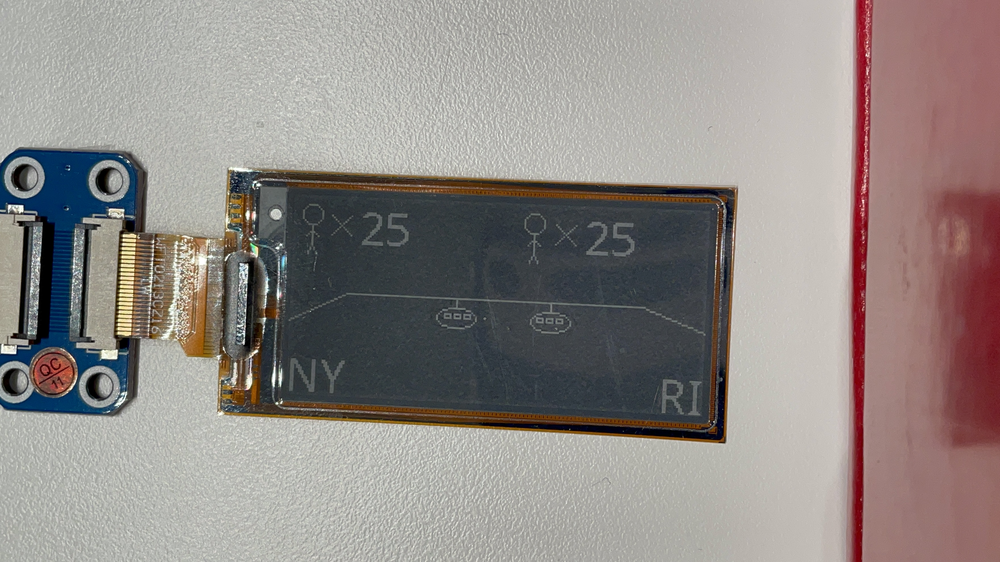

### Front View of TramWatch
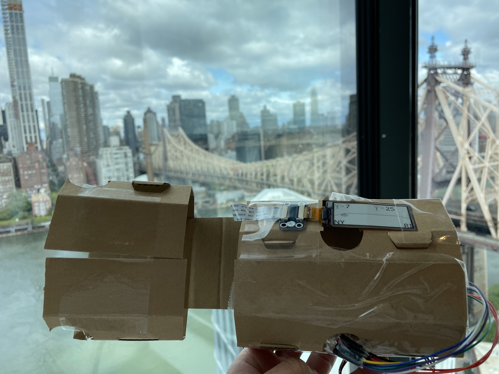

### User View of TramWatch
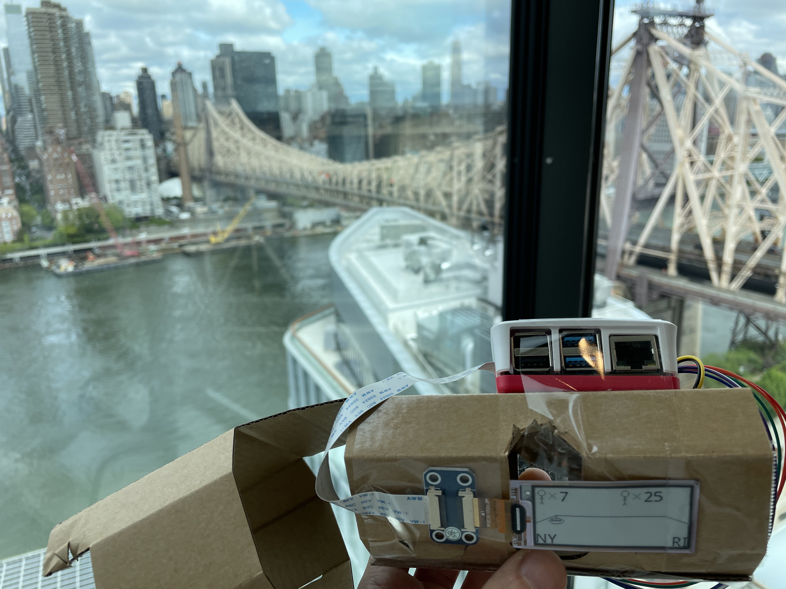

### Top View of TramWatch
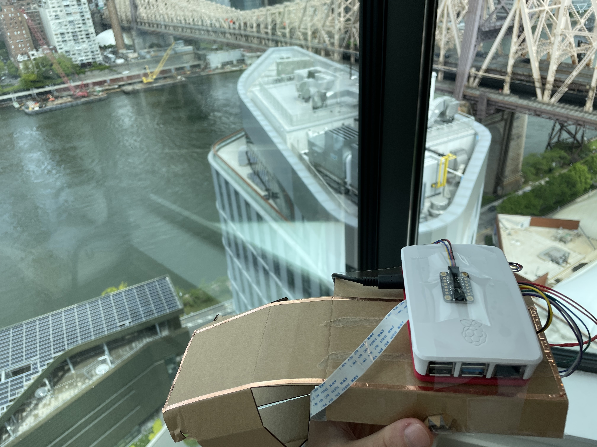

### Side View 1 of TramWatch
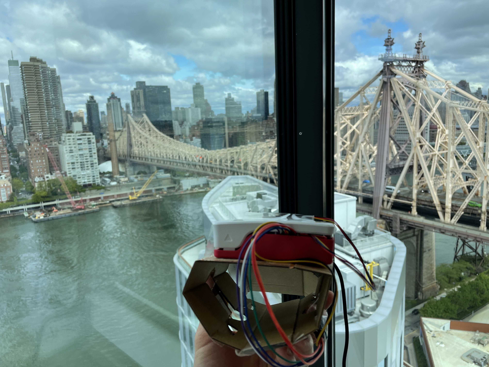

### Side View 2 of TramWatch
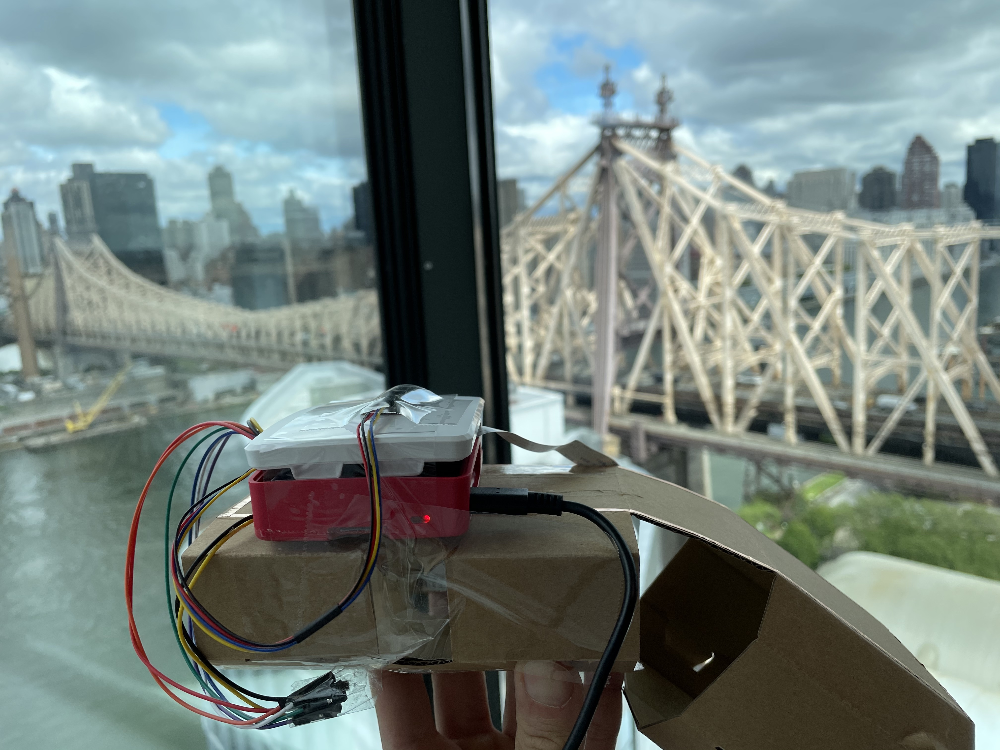

### God's View of TramWatch
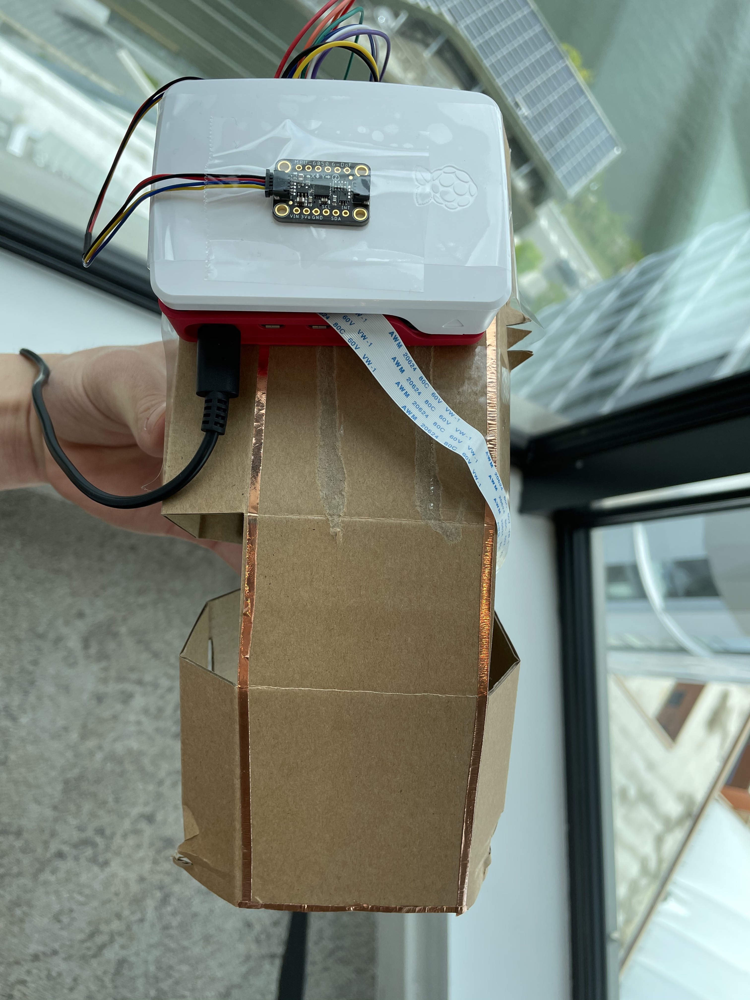

### User Interaction
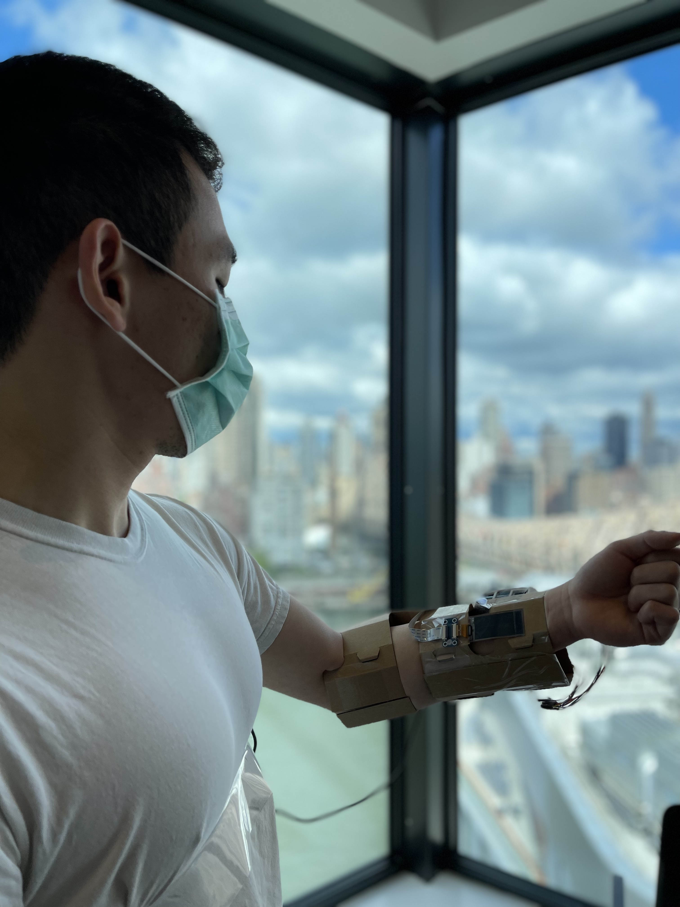

### User Interaction with view of the tram
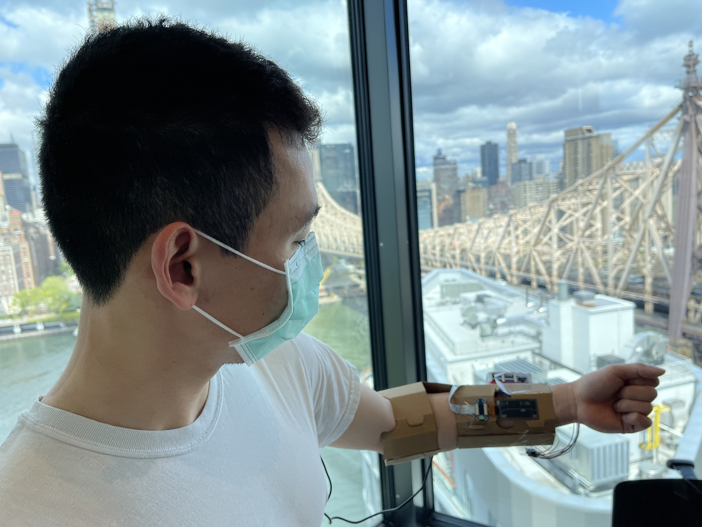

### Thanos' pose with view of the tram
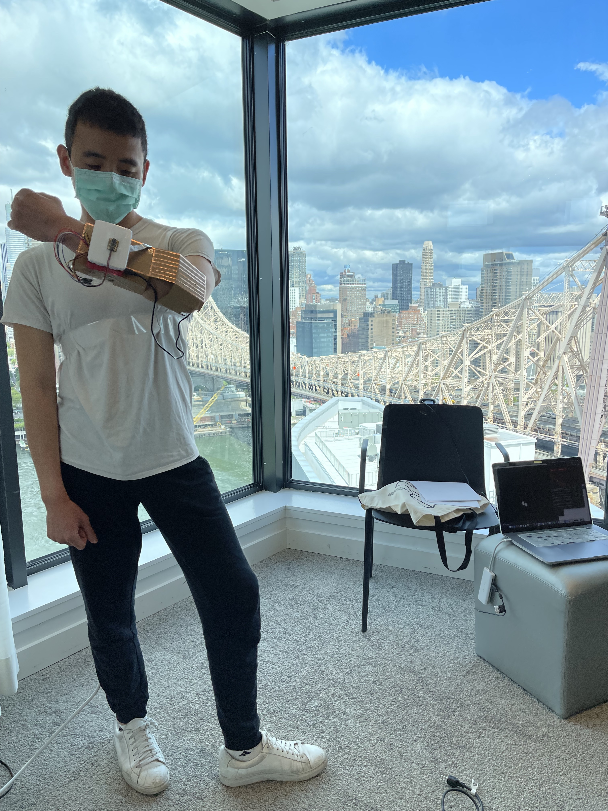

### Final Video 

## Reflection
Justin Liu - I wish I knew more about MQTT before coming into this lab, using it has showed that making connected devices isn’t as complicated as I previously thought. If we had more time, we could have probably added some more interactive features to the glove/gauntlet/wrist-watch such as touch controls and even gesture recognition.

Angus (Ting-Yu) Lin - Tensorflow’s object detection API is not great to use due to poor documentation. It took a long time to find the object classes for people. Nevertheless, I love this idea and I think it will enhance my life and the life of others around me.

Eric (Yen-Hao) Chen - I really like the idea of creating an interactive connected device and the cardboard really made it looks much more like a watch/glove. For the display, I wish it's a colored display instead of black and white, and we also tried out differnet tram line angles before started coding onto the display to make it look like the Roosevelt Island Tram. Also we only implemented 2-3 sensors on the it, with more time, we could put those metal tape to use and create more interactions. Last but not least, MQTT was extremely useful and I we learned about it at the beginning of the semester. 

## Deliverables

1. Documentation of design process
2. Archive of all code, design patterns, etc. used in the final design. (As with labs, the standard should be that the documentation would allow you to recreate your project if you woke up with amnesia.)
3. Video of someone using your project (or as safe a version of that as can be managed given social distancing)
4. Reflections on process (What have you learned or wish you knew at the start?)

## Examples

[Here is a list of good final projects from previous classes.](https://github.com/FAR-Lab/Developing-and-Designing-Interactive-Devices/wiki/Previous-Final-Projects)
This version of the class is very different, but it may be useful to see these.
