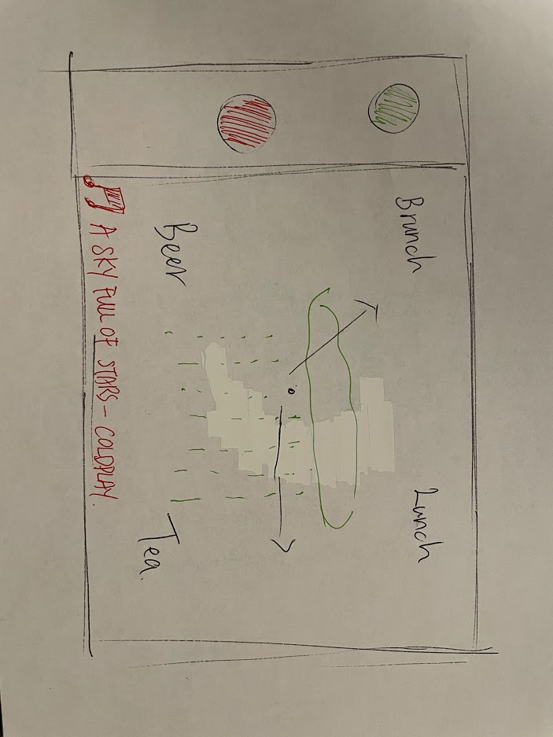
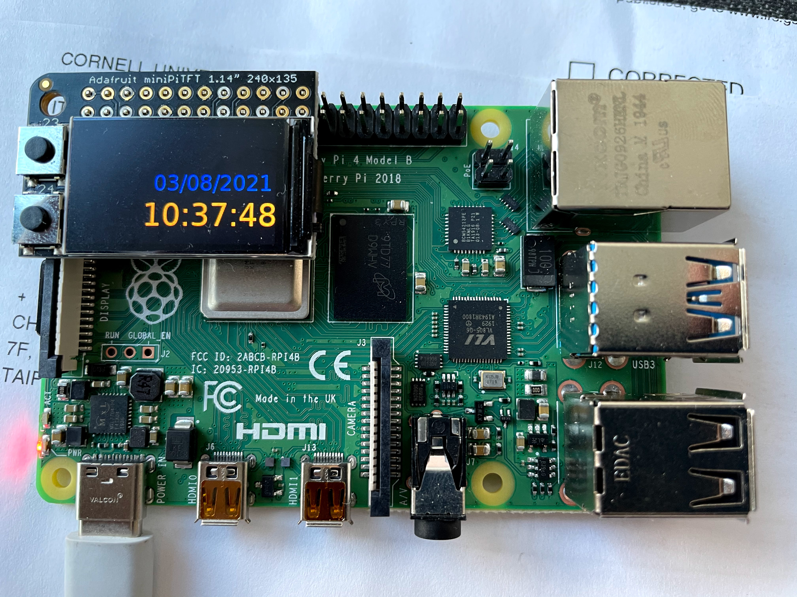
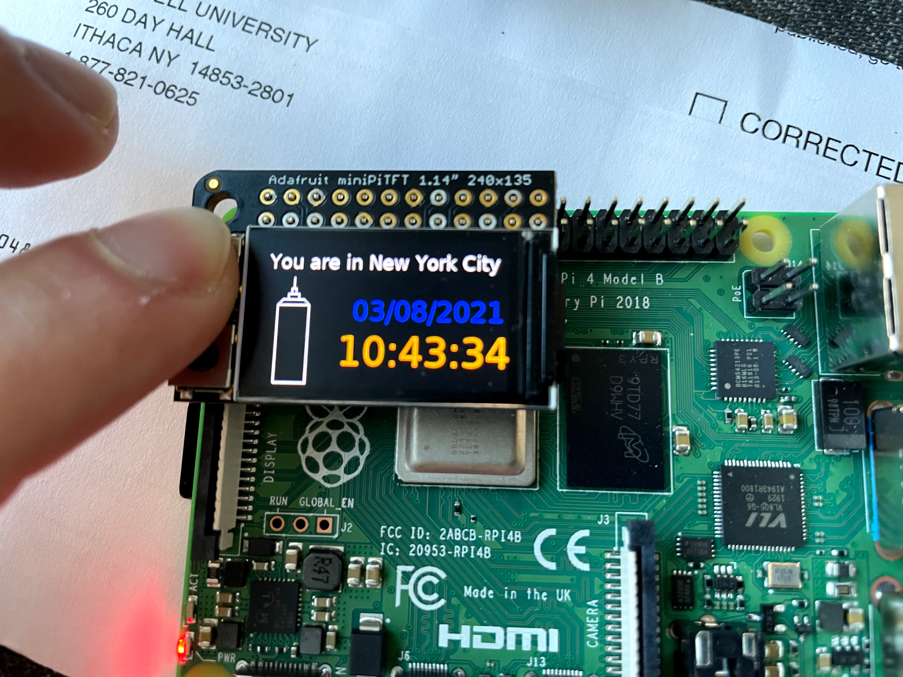
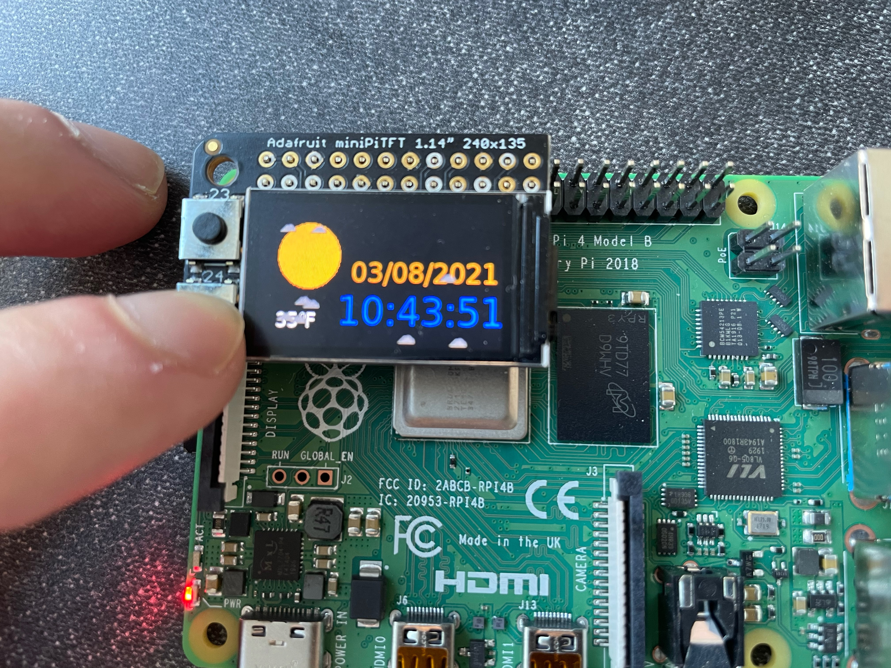
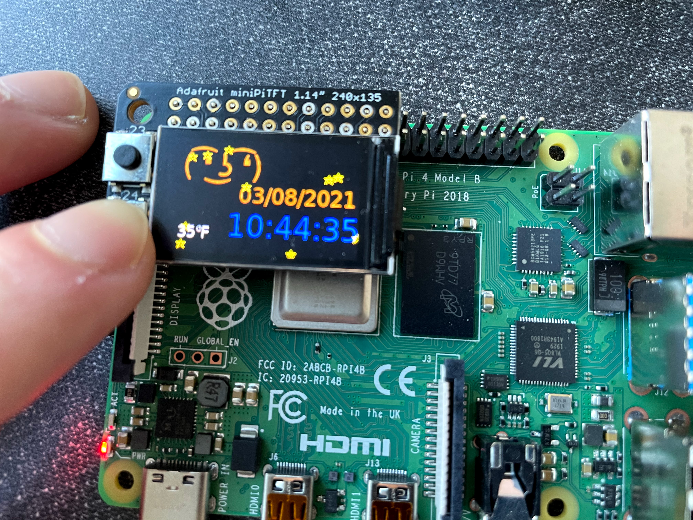

# The Clock of Pi

Does it feel like time is moving strangely during the pandemic?

For our first Pi project, we will pay homage to the [timekeeping devices of old](https://en.wikipedia.org/wiki/History_of_timekeeping_devices) by making simple clocks.

It is worth spending a little time thinking about how you mark time, and what would be useful in a clock of your own design.

**Please indicate anyone you collaborated with on this Lab here.**
Be generous in acknowledging their contributions! And also recognizing any other influences (e.g. from YouTube, Github, Twitter) that informed your design. 
Ming-Chun Lu
Justin Liu
Cheng-Wei Hu
Angus Lin

## Prep

[Lab prep](prep.md) is extra long this week! Make sure you read it over in time to prepare for lab on Wednesday.

### Get your kit
If you are overseas, you should have already ordered your parts.

If you are remote but in the US, the teaching team mailed parts last week.

If you are in New York, you can pick up your parts. If you have not picked up your parts by class you should come to Tata 351.

### Set up your Lab 2

1. [Pull changes from the Interactive Lab Hub](https://github.com/FAR-Lab/Developing-and-Designing-Interactive-Devices/blob/2021Spring/readings/Submitting%20Labs.md#to-pull-lab-updates) so that you have your own copy of Lab 2 on your own lab hub. (This may have to be done again at the start of lab on Wednesday.)

In terminal cd into your Interactive-Lab-Hub folder and run 

```
Interactive-Lab-Hub $ git remote add upstream https://github.com/FAR-Lab/Interactive-Lab-Hub.git
Interactive-Lab-Hub $ git pull upstream Spring2021
Interactive-Lab-Hub $ git add .
Interactive-Lab-Hub $ git commit -m'merge'
Interactive-Lab-Hub $ git push
```

Your local and remote should now be up to date with the most recent files.

2. Go to the [lab prep page](prep.md) to inventory your parts and set up your Pi.


## Overview
For this assignment, you are going to 

A) [Connect to your Pi](#part-a)  

B) [Try out cli_clock.py](#part-b) 

C) [Set up your RGB display](#part-c)

D) [Try out clock_display_demo](#part-d) 

E) [Modify the code to make the display your own](#part-e)

F) [Make a short video of your modified barebones PiClock](#part-f)

G) [Sketch and brainstorm further interactions and features you would like for your clock for Part 2.](#part-g)

## The Report
This readme.md page in your own repository should be edited to include the work you have done. You can delete everything but the headers and the sections between the **stars**. Write the answers to the questions under the starred sentences. Include any material that explains what you did in this lab hub folder, and link it in the readme.

Labs are due on Mondays. Make sure this page is linked to on your main class hub page.

## Part A. 
## Connect to your Pi
Just like you did in the lab prep, ssh on to your pi. Once there create a Python environment.

```
ssh pi@ixe00
pi@ixe00:~ $ virtualenv circuitpython
pi@ixe00:~ $ source circuitpython/bin/activate
(circuitpython) pi@ixe00:~ $ 

```

## Part B. 
### Try out the Command Line Clock
Clone the repo for this assignment

```
(circuitpython) pi@ixe00:~$ git clone https://github.com/YOURGITID/Interactive-Lab-Hub.git
(circuitpython) pi@ixe00:~$ cd Interactive-Lab-Hub/Lab\ 2/
(circuitpython) pi@ixe00:~/Interactive-Lab-Hub $ 
```

Install the packages from the requirements.txt and run the example

```
(circuitpython) pi@ixe00:~/Interactive-Lab-Hub $ pip install -r requirements.txt
(circuitpython) pi@ixe00:~/Interactive-Lab-Hub/Lab 2 $ python cli_clock.py 
02/24/2021 11:20:49
```
you can press `ctrl-c` to exit.
If you're unfamiliar with the Python code in `cli_clock.py` have a look at [this Python refresher](https://hackernoon.com/intermediate-python-refresher-tutorial-project-ideas-and-tips-i28s320p). If you're still concerned, please reach out to the teaching staff!


## Part C. 
## Set up your RGB Display
We will introduce you to the [Adafruit MiniPiTFT](https://www.adafruit.com/product/4393) and Python on the Pi.


The Raspberry Pi 4 has a variety of interfacing options. When you plug the pi in the red power LED turns on. Any time the SD card is accessed the green LED flashes. It has standard USB ports and HDMI ports. Less familiar it has a set of 20x2 pin headers that allow you to connect a various peripherals.


To learn more about any individual pin and what it is for go to [pinout.xyz](https://pinout.xyz/pinout/3v3_power) and click on the pin. Some terms may be unfamiliar but we will go over the relevant ones as they come up.

### Hardware

From your kit take out the display and the [Raspberry Pi 4](https://www.adafruit.com/product/4296 | width=200)

Line up the screen and press it on the headers. The hole in the screen should match up with the hole on the raspberry pi.

<p float="left">


</p>

#### Testing your Screen

The display uses a communication protocol called [SPI](https://www.circuitbasics.com/basics-of-the-spi-communication-protocol/) to speak with the raspberry pi. We won't go in depth in this course over how SPI works. The port on the bottom of the display connects to the SDA and SCL pins used for the I2C communication protocol which we will cover later. GPIO (General Purpose Input/Output) pins 23 and 24 are connected to the two buttons on the left. GPIO 22 controls the display backlight.

We can test it by typing 
```
python screen_test.py
```

You can type the name of a color then press either of the buttons to see what happens on the display. Take a look at the code with
```
cat screen_test.py
```

#### Displaying Info
You can look in `stats.py` for how to display text on the screen

#### Displaying an image

You can look in `image.py` for an example of how to display an image on the screen. Can you make it switch to another image when you push one of the buttons?


## Part D. 
## Set up the Display Clock Demo

In `screen_clock.py`. Show the time by filling in the while loop. You can use the code in `cli_clock.py` and `stats.py` to figure this out.


## Part E.
## Modify the barebones clock to make it your own

Does time have to be linear?  How do you measure a year? [In daylights? In midnights? In cups of coffee?](https://www.youtube.com/watch?v=wsj15wPpjLY)   
When the top button is pressed it shows the current date and the time.

Can you make time interactive? You can look in `screen_test.py` for examples for how to use the buttons.  
I made it an interactive clock. By pressing onto the top button, it shows the detailed date and time. 
By pressing onto the bottom button, the clock will check whether if the time has passed 17:00.   
If it has, it will show as many stars on the display as the hour of the time.   
For example, if it's 17:56 it shows 17 stars and if it's 20:34, it shows 20 stars.   
The stars are displyed in random locations within the display a starry night vibe.   
On the other hand, if it's during the day time, a sun will be diaplayed. 

**A copy of your code should be in your Lab 2 Github repo.**

You can push to your personal github repo by adding the files here, commiting and pushing.

```
git add .
git commit -m'your message here'
git push
```

After that, git will ask you to login to your github account to upload.

## Part F. 
## Make a short video of your modified barebones PiClock

**Take a video of your PiClock.**  
[Day time](https://youtu.be/ZPuUuGyGg9o)   
[Night time](https://youtu.be/IIfrV2DGWEk)

## Part G. 
## Sketch and brainstorm further interactions and features you would like for your clock for Part 2.



I would refer the top buttun as the green buttun and the bottom buttun as the red button here.   
By not holding any button, the clock would just show the time like a regular clock, with labels such as Brunch, Lunch, Tea, Beer to make it more fun. 
When the red buttun is activated, the clock would show the weather of the day to give user a better sense of what do look out for. 
When the green buttun is activated, the clock would show a song that best represent the weather of the day and provide more fun to the user.   
For example, the user can guess how the weather like outside, just by listneing to the music provided. 

  
=======
## Prep for Part 2

1. Pick up remaining parts for kit.

2. Look at and give feedback on the Part G. for at least 2 other people in the class (and get 2 people to comment on your Part G!)

# Lab 2 Part 2

Pull Interactive Lab Hub updates to your repo.

Modify the code from last week's lab to make a new visual interface for your new clock. You may [extend the Pi](Extending%20the%20Pi.md) by adding sensors or buttons, but this is not required.

As always, make sure you document contributions and ideas from others explicitly in your writeup.

You are permitted (but not required) to work in groups and share a turn in; you are expected to make equal contribution on any group work you do, and N people's group project should look like N times the work of a single person's lab. What each person did should be explicitly documented. Make sure the page for the group turn in is linked to your Interactive Lab Hub page. 


## Part E.
## Modify the barebones clock to make it your own

Does time have to be linear?  How do you measure a year? [In daylights? In midnights? In cups of coffee?](https://www.youtube.com/watch?v=wsj15wPpjLY)   
When the top button is pressed it shows the current date and the time.

Can you make time interactive? You can look in `screen_test.py` for examples for how to use the buttons.  
I made it an interactive clock, which shows the detailed date and time with a slightly larger font.  
I also made it the detailed time and date into two lines with two different colors: blue and orange. Every second the two colors switches.
By pressing onto the top button, the clock will check the location of the area and shows the name of the location and an iconic symbol of the location 
(Empire State Building for New York City)  
By pressing onto the bottom button, the clock will check whether if the time has passed 17:00.   
If it has, it will show a moon and also as many stars on the display as the hour of the time.   
For example, if it's 17:56 it shows 17 stars and if it's 20:34, it will show a moon and 20 stars.   
The stars are displyed in random locations within the display a starry night vibe.    
On the other hand, if it's during the day time, a sun and clouds will be diaplayed.   
Also for either button pressed, the clock will display the temperature of the location in Fahrenheit.

**A copy of your code should be in your Lab 2 Github repo.**

You can push to your personal github repo by adding the files here, commiting and pushing.

```
git add .
git commit -m'your message here'
git push
```

After that, git will ask you to login to your github account to upload.








## Part F. 
## Make a short video of your modified updated barebones PiClock

**Take a video of your Updated PiClock.**  
[Day time Part 2](https://www.youtube.com/watch?v=VQzlUkuDzVk)   
[Night time Part 2](https://www.youtube.com/watch?v=oxneYjGGiIQ)


