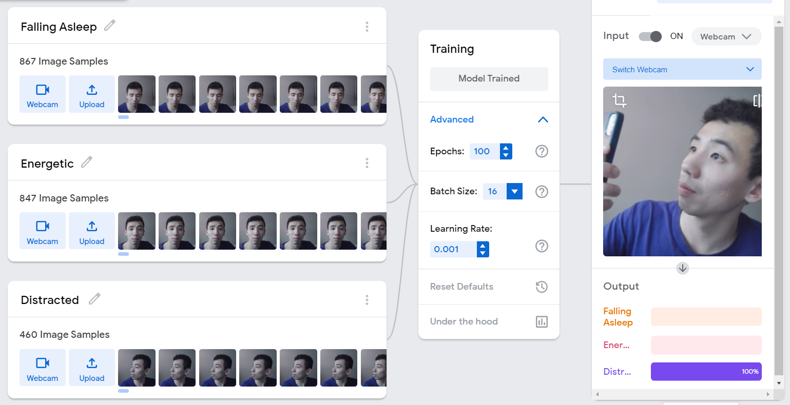
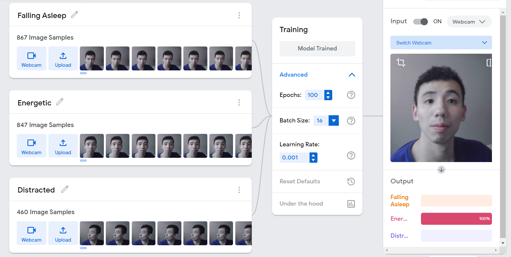
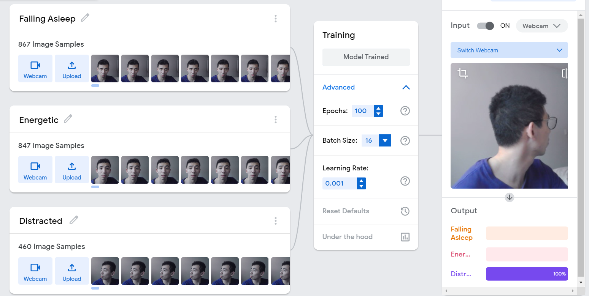
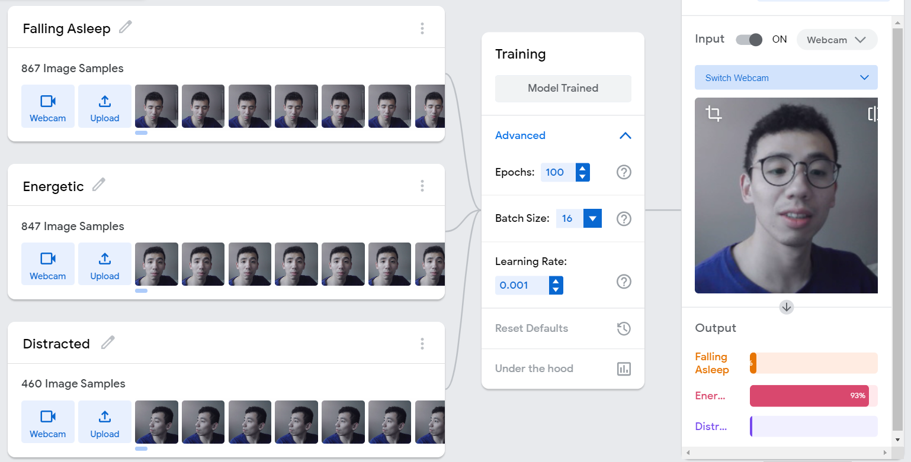
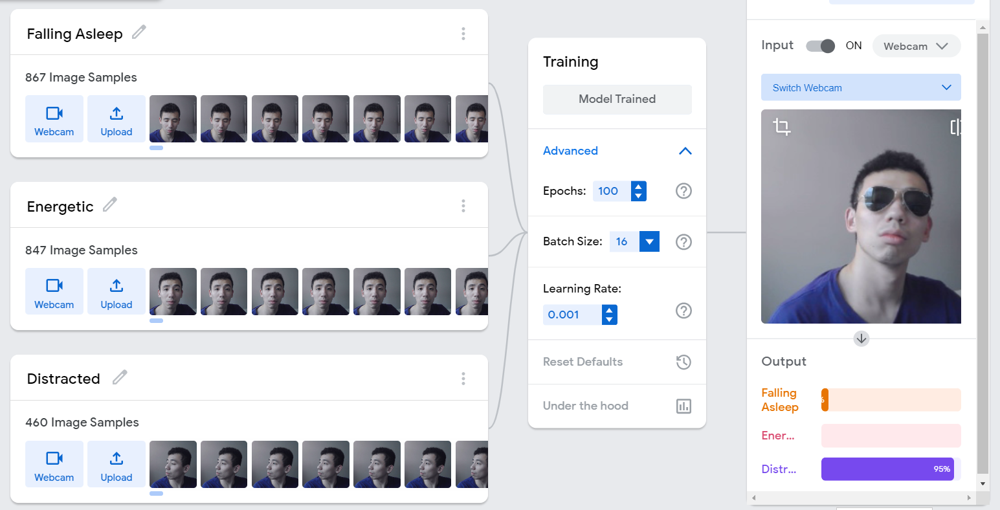
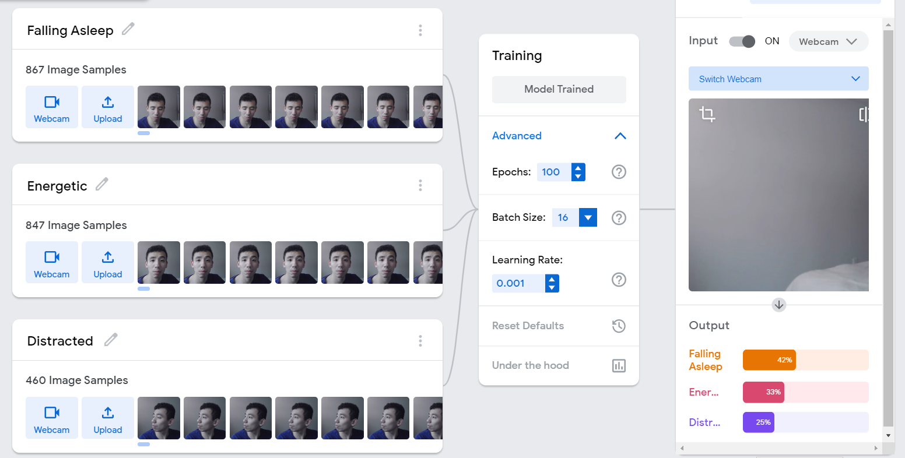

# Observant Systems


For lab this week, we focus on creating interactive systems that can detect and respond to events or stimuli in the environment of the Pi, like the Boat Detector we mentioned in lecture. 
Your **observant device** could, for example, count items, find objects, recognize an event or continuously monitor a room.

This lab will help you think through the design of observant systems, particularly corner cases that the algorithms need to be aware of.

In Lab 5 part 1, we focus on detecting and sense-making.

In Lab 5 part 2, we'll incorporate interactive responses.


## Prep

1.  Pull the new Github Repo.
2.  Read about [OpenCV](https://opencv.org/about/).
3.  Read Belloti, et al's [Making Sense of Sensing Systems: Five Questions for Designers and Researchers](https://www.cc.gatech.edu/~keith/pubs/chi2002-sensing.pdf)

### For the lab, you will need:

1. Raspberry Pi
1. Raspberry Pi Camera (2.1)
1. Microphone (if you want speech or sound input)
1. Webcam (if you want to be able to locate the camera more flexibly than the Pi Camera)

### Deliverables for this lab are:
1. Show pictures, videos of the "sense-making" algorithms you tried.
1. Show a video of how you embed one of these algorithms into your observant system.
1. Test, characterize your interactive device. Show faults in the detection and how the system handled it.


## Overview
Building upon the paper-airplane metaphor (we're understanding the material of machine learning for design), here are the four sections of the lab activity:

A) [Play](#part-a)

B) [Fold](#part-b)

C) [Flight test](#part-c)

D) [Reflect](#part-d)

---

### Part A
### Play with different sense-making algorithms.

Befor you get started connect the RaspberryPi Camera V2. [The Pi hut has a great explanation on how to do that](https://thepihut.com/blogs/raspberry-pi-tutorials/16021420-how-to-install-use-the-raspberry-pi-camera).  

#### OpenCV
A more traditional to extract information out of images is provided with OpenCV. The RPI image provided to you comes with an optimized installation that can be accessed through python.

Additionally, we also included 4 standard OpenCV examples. These examples include contour(blob) detection, face detection with the ``Haarcascade``, flow detection(a type of keypoint tracking), and standard object detection with the [Yolo](https://pjreddie.com/darknet/yolo/) darknet.

Most examples can be run with a screen (I.e. VNC or ssh -X or with an HDMI monitor), or with just the terminal. The examples are separated out into different folders. Each folder contains a ```HowToUse.md``` file, which explains how to run the python example.

```shell
pi@ixe00:~/openCV-examples $ tree -l
.
├── contours-detection
│   ├── contours.py
│   └── HowToUse.md
├── data
│   ├── slow_traffic_small.mp4
│   └── test.jpg
├── face-detection
│   ├── face-detection.py
│   ├── faces_detected.jpg
│   ├── haarcascade_eye_tree_eyeglasses.xml
│   ├── haarcascade_eye.xml
│   ├── haarcascade_frontalface_alt.xml
│   ├── haarcascade_frontalface_default.xml
│   └── HowToUse.md
├── flow-detection
│   ├── flow.png
│   ├── HowToUse.md
│   └── optical_flow.py
└── object-detection
    ├── detected_out.jpg
    ├── detect.py
    ├── frozen_inference_graph.pb
    ├── HowToUse.md
    └── ssd_mobilenet_v2_coco_2018_03_29.pbtxt
```
#### Filtering, FFTs, and Time Series data. (beta, optional)
Additional filtering and analysis can be done on the sensors that were provided in the kit. For example, running a Fast Fourier Transform over the IMU data stream could create a simple activity classifier between walking, running, and standing.

Using the set up from the [Lab 3 demo](https://github.com/FAR-Lab/Interactive-Lab-Hub/tree/Spring2021/Lab%203/demo) and the accelerometer, try the following:

**1. Set up threshold detection** Can you identify when a signal goes above certain fixed values?

**2. Set up averaging** Can you average your signal in N-sample blocks? N-sample running average?

**3. Set up peak detection** Can you identify when your signal reaches a peak and then goes down?

Include links to your code here, and put the code for these in your repo--they will come in handy later.

#### Teachable Machines (beta, optional)
Google's [TeachableMachines](https://teachablemachine.withgoogle.com/train) might look very simple.  However, its simplicity is very useful for experimenting with the capabilities of this technology.

You can train a Model on your browser, experiment with its performance, and then port it to the Raspberry Pi to do even its task on the device.

Here is Adafruit's directions on using Raspberry Pi and the Pi camera with Teachable Machines:

1. [Setup](https://learn.adafruit.com/teachable-machine-raspberry-pi-tensorflow-camera/raspberry-pi-setup)
2. Install Tensorflow: Like [this](https://learn.adafruit.com/running-tensorflow-lite-on-the-raspberry-pi-4/tensorflow-lite-2-setup), but use this [pre-built binary](https://github.com/bitsy-ai/tensorflow-arm-bin/) [the file](https://github.com/bitsy-ai/tensorflow-arm-bin/releases/download/v2.4.0/tensorflow-2.4.0-cp37-none-linux_armv7l.whl) for Tensorflow, it will speed things up a lot.
3. [Collect data and train models using the PiCam](https://learn.adafruit.com/teachable-machine-raspberry-pi-tensorflow-camera/training)
4. [Export and run trained models on the Pi](https://learn.adafruit.com/teachable-machine-raspberry-pi-tensorflow-camera/transferring-to-the-pi)

Alternative less steps option is [here](https://github.com/FAR-Lab/TensorflowonThePi).

#### PyTorch  
As a note, the global Python install contains also a PyTorch installation. That can be experimented with as well if you are so inclined.

### Part B
### Construct a simple interaction.

Pick one of the models you have tried, pick a class of objects, and experiment with prototyping an interaction.
This can be as simple as the boat detector earlier.
Try out different interactions outputs and inputs.
**Describe and detail the interaction, as well as your experimentation.**

I started with installing the pi camera and trying out opencv examples and demos. I was able to capture faces and indentify the contour of each human face which I find very interesting. Then I experimented Teachable Machines, which absolutely blew my mind. I love the simplicity of the system as well as how well it reacts to my limited training data. Great job Google!
<br>
According to CDC, careless driving is responsible for 33% of fatal crashes in America and there are three major types of careless driving:  
1. Visual distractions that take your eyes off of the road  
2. Manual distractions that take your hands off the wheel  
3. Cognitive distractions that take your mind off of driving  
<br>
https://www.cdc.gov/transportationsafety/distracted_driving/index.html  
<br><br>
While it's difficult to address the third type, visual distractions and manual distractions can be mitigated using computer vision technology. Identifying tired or distracted drivers nehind the wheel could effectively reduce the percentage of fatal crashes caused by careless driving especially for those whose jobs are driving such as bus and taxi drivers.  
Although autonomous driving would be the next big thing, it is still important for monitor driver's condition while on the road at the moment. (2021) I came up with the idea of identifying condition of drivers while on the road.  
  
A google TeachableMachine was trained to be a driver condition monitor. It can detect either a driver is currently tired, distracted or energetic.
<br>
Construct a simple interaction.  
<br>
Falling Asleep
<br>

<br>
Distracted
<br>

<br>
Energetic
<br>
  

This is so exciting! Test the model with your computer webcam.  
[Link](https://teachablemachine.withgoogle.com/models/p8SOAF0MN/)

### Part C
### Test the interaction prototype

Now flight test your interactive prototype and **note your observations**:
For example:
1. When does it what it is supposed to do?
2. When does it fail?
3. When it fails, why does it fail?  
4. Based on the behavior you have seen, what other scenarios could cause problems?

With myself in the camera, the model works well most of the time. This is mainly due to the same person for training and testing and the decent amount of training images data. (867 images for class Falling Alseep, 847 images for Energetic, 460 images for Distracted)
<br>
I tried out different possible scenarios for a drivers. For example, drivers wearing glasses, driver wearing sunglasses as well as no driver on the car. The reason why I inputted the scenario of no driver on the car is because I plan to develop an alarming system when driver's falling asleep or distracted, and I don't want to start a false alarm when the driver leaves or changes shift.  
<br>
The first attmept I tried was the scenario of driver wearing glasses. Surprisingly, for all three cases it exceeds the expectation. 
<br>
Falling Asleep with Glasses
<br>
  
<br>
Distracted with Glasses
<br>
  
<br>
Energetic with Glasses
<br>
  
<br>


The system fails when driver is wearing sunglasses, also when no driver is in front of the camera. This was predictable being no training data of driver wearing sunglasses or leaving the seat was added into the training process. 
Besides, the percentage fluctuates from time to time this might due to two reasons.  
    1. Facial expressions are relatively subtle, therefore the system might not be accurately capturing the driver's condition.  
    2. Although having sdecent amount of training data, it's still not enough data to capture the accurate expression.

    Please see the following failed images:   
  
  


Based on the behavior I've seen, there are a lot of scenarios that could potentially be a problem. For example, the scenarios of user being someone else, lighting, background, race, length/ color/ texture of hairstyle/ clothes, the distance between the camera and the user could all cause problems.   


**Think about someone using the system. Describe how you think this will work.**
1. Are they aware of the uncertainties in the system?
1. How bad would they be impacted by a miss classification?
1. How could change your interactive system to address this?
1. Are there optimizations you can try to do on your sense-making algorithm.

I thought about it and actually invite an user to try out the system. They are aware of the fluctuation of the results from time to time but not really the specific uncertainties such as lighting and length/ color/ texture of the hair/ clothes. 
<br>
For a professional driver who is using the system in a real world setting, a miss classification would greatly impact him/her life. For exmaple, we would not want to miss classify a driver falling asleep to energetic, this could put a lot of lives in risk.   
For the users are just using this for a fun, it does not have much impact unless it's a competitive game that might cause unfairness. 
<br>
In ordert to address the problem would be quite tricky. One thing I can think of is to combine multiple sensors and take all results into consideration to eliminate possible miss classification. For example, by combining face expression detection, with eyeball condition detection/ heart beat tracker to indentify if the driver is either tired to distracted, but by doing this it creates a lot ethical problems as well.  
One possible optimization would be have more training data available for the model particularly the data of real world drivers including different race, ethnicity, skin color and also address the above mentioend uncentainties.  
The other possible optimization I can think of would be adding more classes and identify/ eliminate some classes might cause miss classification. 

### Part D
### Characterize your own Observant system

Now that you have experimented with one or more of these sense-making systems **characterize their behavior**.
During the lecture, we mentioned questions to help characterize a material:
* What can you use X for?
* What is a good environment for X?
* What is a bad environment for X?
* When will X break?
* When it breaks how will X break?
* What are other properties/behaviors of X?
* How does X feel?
<br>
<br>
<br>

* What can you use X for?  

Driver condition recognition is great for detecting focused /tired/ distracted faces. This can be widely apply to other long hour jobs that requires constant attention such as pilots, captains, teachers etc.   

* What is a good environment for X?  
* What is a bad environment for X?

The perfect environemnt would be a location where the video resolution is great, lighting and background conditions are stable and most importantly the data can't be too complicated (noisy). Since the targeted customers are drivers in general and they usually have a stable setting, the lightign and background wouldn't be too big of a problem.  
One problem I can think of is the lighting in vehicles, since the car is constantly moving it's difficult to adjust to the constantly changing lighting condition on the road.  
A bad environment would be somewhere with lots of complicated and noisy data such as a lot of people at the same time. This would be difficult for the system to identify which user to capture. Other genral reasons would be bad lighting with lots of variance, or poor video quality.

* When will X break?
* When it breaks how will X break?

If the system get placed in any bad environment, there is a high chance that it will break. 
To determine how it would break really depends on the input. There are two main possible cases:  
    1. Not detecting a driver or 2. incorrectly detect a driver's condition. 

* What are other properties/behaviors of X?
* How does X feel?

What surprises me is that the abililty to detect things that weren't in the training data and provide results. I trained the model without glasses but the model was able to correctly label the facial condition even when I was wearing glasses.  
It is awesome when it works, as if the systme understands what the goals is and generate a variety of data provided within expectation. 

**Include a short video demonstrating the answers to these questions.**
[Model in Action](https://youtu.be/-SdAM2wMt7w)


### Part 2.

Following exploration and reflection from Part 1, finish building your interactive system, and demonstrate it in use with a video.

**Include a short video demonstrating the finished result.**
[Final Model](https://youtu.be/MZajo9BKpdQ)

