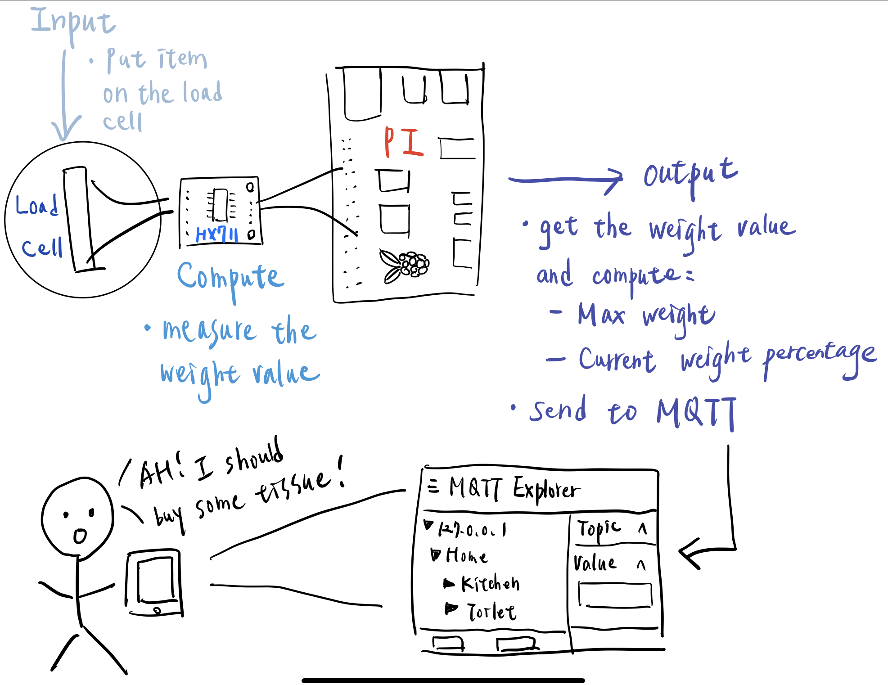
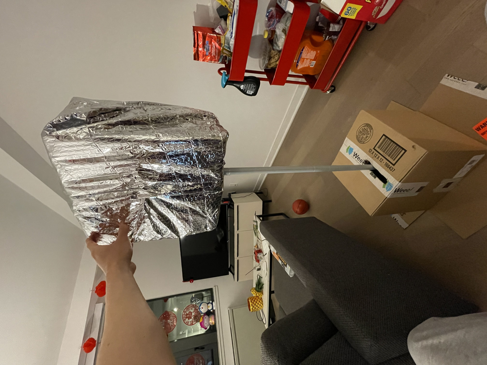
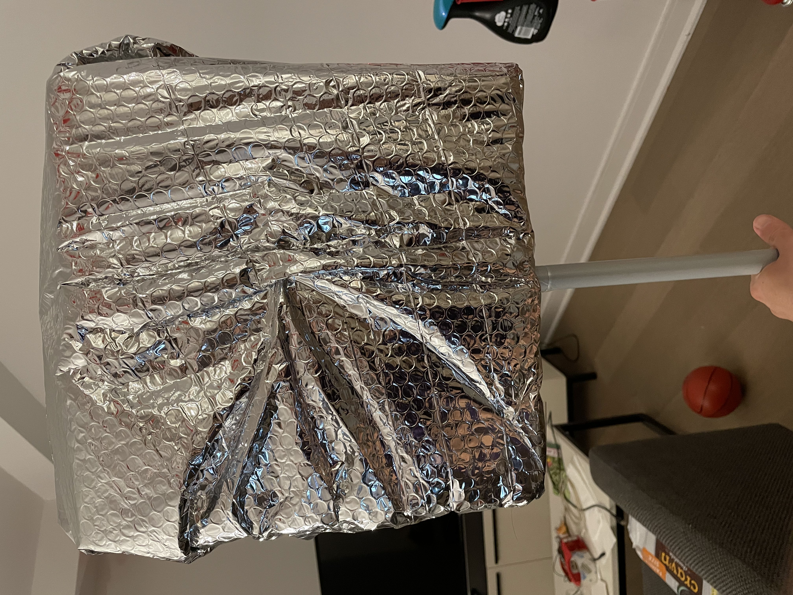
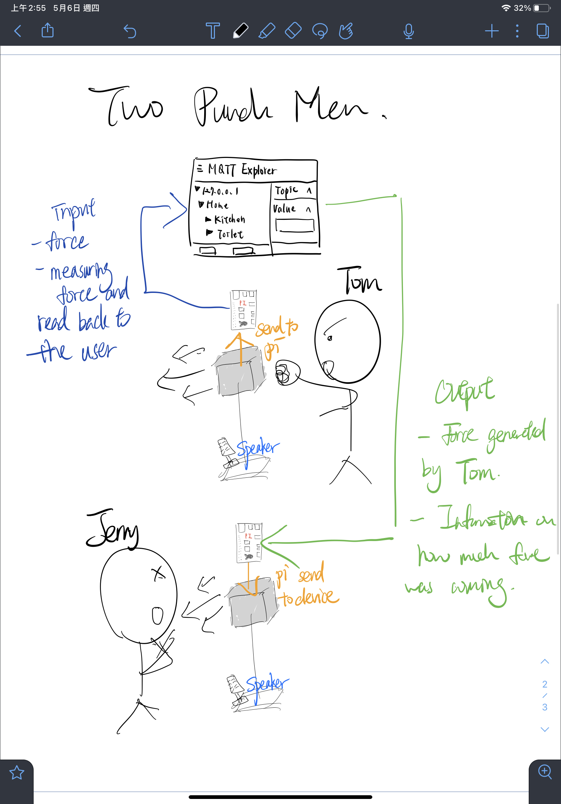

# m[Q](https://en.wikipedia.org/wiki/QAnon)tt[Anon](https://en.wikipedia.org/wiki/QAnon): Where We Go One, We Go All

## Prep

1. Pull the new changes
2. Install [MQTT Explorer](http://mqtt-explorer.com/)
3. Readings 
   * [MQTT](#MQTT)
   * [The Presence Table](https://dl.acm.org/doi/10.1145/1935701.1935800) and [video](https://vimeo.com/15932020)

## Introduction

The point of this lab is to introduce you to distributed interaction. We've included a some Natural Language Processing (NLP) and Generation (NLG) but those are not really the emphasis. Feel free to dig into the examples and play around the code which you can integrate into your projects. However we want to emphasize the grading will focus on your ability to develop interesting uses for messaging across distributed devices. 

## MQTT

MQTT is a lightweight messaging portal invented in 1999 for low bandwidth networks. It was later adopted as a defacto standard for a variety of Internet of Things (IoT) devices. 

### The Bits

* **Broker** - The central server node that receives all messages and sends them out to the interested clients. Our broker is hosted on the far lab server (Thanks David!) at `farlab.infosci.cornell.edu/8883`
* **Client** - A device that subscribes or publishes information on the network
* **Topic** - The location data gets published to. These are hierarchical with subtopics. If you were making a network of IoT smart bulbs this might look like `home/livingroom/sidelamp/light_status` and `home/livingroom/sidelamp/voltage`. Subscribing to `home/livingroom/sidelamp/#` would give you message updates to both the light_status and the voltage. Because we use this broker for a variety of projects you have access to read, write and create subtopics of `IDD`. This means `IDD/ilan/is/a/goof` is a valid topic you can send data messages to.
*  **Subscribe** - This is a way of telling the client to pay attention to messages the broker sends out on that topic. You can subscribe to a specific topic or subtopics. You can also unsubscribe
* **Publish** - This is a way of sending messages to a topic. You can publish to topics you don't subscribe to. Just remember on our broker you are limited to subtopics of `IDD`

Setting up a broker isn't much work but for the purposes of this class you should all use the broker we've set up for you. 

### Useful Tooling

Debugging and visualizing what's happening on your MQTT broker can be helpful. We like [MQTT Explorer](http://mqtt-explorer.com/). You can connect by putting in the settings from the image below.

Once connected you should be able to see all the messaged on the IDD topic. From the interface you can send and plot messages as well.

## Send and Receive 

[sender.py](./sender.py) and and [reader.py](./reader.py) show you the basics of using the mqtt in python.  Lets spend a few minutes running these and seeing how messages are transferred and show up. 

**Running Examples**

* Install the packages from `requirements.txt`, ideally in a python environment. We've been using the circuitpython environment we setup earlier this semester. To install them do `pip install -r requirements.txt`
* to run `sender.py` type `python sender.py` and fill in a topic name, then start sending messages. You should see them on MQTT Explorer
* to run `reader.py` type `python reader.py` and you should see any messages being published to `IDD/` subtopics.

## Streaming a Sensor

We've included an updated example from [lab 4](https://github.com/FAR-Lab/Interactive-Lab-Hub/tree/Spring2021/Lab%204) that streams sensor inputs over MQTT. Feel free to poke around with it!

## The One True ColorNet

It is with great fortitude and resilience that we shall worship at the altar of the *OneColor*. Through unity of the collective RGB we too can find unity in our heart, minds and souls. With the help of machines can  overthrow the bourgeoisie, get on the same wavelength (this was also a color pun) and establish [Fully Automated Luxury Communism](https://en.wikipedia.org/wiki/Fully_Automated_Luxury_Communism).

The first step on the path to *collective* enlightenment, plug the [APDS-9960 Proximity, Light, RGB, and Gesture Sensor](https://www.adafruit.com/product/3595) into the [Pi Display](https://www.adafruit.com/product/4393).

You are almost there!

The second step to achieving our great enlightenment is to run `python color.py`

You will find the two squares on the display. Half is showing an approximation of the output from the color sensor. The other half is up to the collective. Press the top button to share your color with the class. Your color is now our color, our color is now your color. We are one. 

I was not super careful with handling the loop so you may need to press more than once if the timing isn't quite right. Also I have't load tested it so things might just immediately break when every pushes the button at once.

You may ask "but what if I missed class?"

Am I not admitted into the collective enlightenment of the *OneColor*?

Of course not! You can got to [https://one-true-colornet.glitch.me/](https://one-true-colornet.glitch.me/) and become one with the ColorNet on the inter-webs.

Glitch is a great tool for prototyping sites, interfaces and web-apps that's worth taking some time to get familiar with if you have a chance. Its not super pertinent for the class but good to know either way. 

## Make it your own

Find at least one class (more are okay) partner, and design a distributed application together. 

My partner for this lab is Ting-Yu(Angus) Lin.  
   
We decided to focus on applications regarding weight and force. Since it's a very interesting domain that we are passionate in, we created a total of two applications:  

>1. Smart home weight measuring Iot: Single person application   

>2. Two-Punch-Men interactive boxing device: Two or more persons application     

**Smart home weight measuring Iot: Single person application**

**1. Explain your design** For example, if you made a remote controlled banana piano, explain why anyone would want such a thing.

> In this lab, I designed an IoT sensor to detect the usage of daily goods, for example, tissue paper, salt, and pepper, etc. It's very common that we couldn't know an item is running out until we find it's the last of it. That's where my design comes in. Basically, I use the weight to measure the usage and indicate the approximate remaining percentage. The detailed architecture will be explained in the next part. In summary, this design becomes helpful, especially when we couldn't easily observe the quantity because the container isn't transparent. Besides, even if we might not know the net weight of the goods inside, the weight percentage is enough to buy the supplement in time once there is a particular drop.

**2. Diagram the architecture of the system.** Be clear to document where input, output and computation occur, and label all parts and connections. For example, where is the banana, who is the banana player, where does the sound get played, and who is listening to the banana music?

**3. Build a working prototype of the system.** Do think about the user interface: if someone encountered these bananas, would they know how to interact with them? Should they know what to expect?

> I think it's intuitive for the user to put something onto the load cell in this prototype setup. However, they might have no idea what to expect after the placement, so it could be better to attach a QR code that leads them to the MQTT portal to see the item's weight, on the PI, or anywhere clear for them.

**4. Document the working prototype in use.** It may be helpful to record a Zoom session where you should the input in one location clearly causing response in another location.

**Two-Punch-Men interactive boxing device: Two or more persons application**

**1. Explain your design** For example, if you made a remote controlled banana piano, explain why anyone would want such a thing.

>During the Covid-19 pandemic, in person contact has been prohibited among the entire world. While the covid situation is not slowing down, we all miss in person contact and tried to conduct exercise and workours at home. Therefore, companies like Mirror, Peloton and Otari siezed such an oppurtunity and provided effective indoor workout equipments.  
Peloton's sales surged 232% year-over-year to $757.9 million, as the fitness company continues to see high global demand for its bikes and treadmills from consumers looking to stay in shape during the coronavirus pandemic.

>We believe that the complete gym experience includes effective workouts equipments to stay fit as well as the valuable in person interactions. Even we were able to conduct effective workouts at home to stay healthy, don't all miss the interaction that gym and boxing classes offer? 

>Two-Punch-Men interactive boxing device creates an unique experience that not only help you meet your personal fitness goals but also keep the in person interaction fun at home. Let's take Tom and Jerry as example, if Tom punches hard onto the device, through raspberry pi the deice would record the force applied by Tom, read it back to Tom in kilograms and send it to MQTT.   
Meanwhile at Jerry's room, the two punch men would retrieve the data from MQTT and read amount of force generated by Tom as a warning to Jerry. The two punch men device would then generate equal amount of force on Jerry's device. Jerry would be ready to take the punch generated by Tom and complete the interaction.  

**2. Diagram the architecture of the system.** Be clear to document where input, output and computation occur, and label all parts and connections. For example, where is the banana, who is the banana player, where does the sound get played, and who is listening to the banana music?

  
  
  

**3. Build a working prototype of the system.** Do think about the user interface: if someone encountered these bananas, would they know how to interact with them? Should they know what to expect?

> I don't think it's too difficult for the user to understand how to interact with the device. The existing audio warnings prepare Tom and Jerry and inform each other on when the punch is coming and when to get ready to do defense. The subtle timing warnings improve user experience and prevent both Tom and Jerry from being hit without having adequate signs of warnings. 

>Although the silver box invites the user to apply force onto it, it would be much more intuitive for the user if additional audio instruction was implemented in the device.

> Another possible improvement for the system would be adding lighting interaction onto the device to create better incentive for the user to apply force onto it. 

**4. Document the working prototype in use.** It may be helpful to record a Zoom session where you should the input in one location clearly causing response in another location.

**5. BONUS (Wendy didn't approve this so you should probably ignore it)** get the whole class to run your code and make your distributed system BIGGER.
